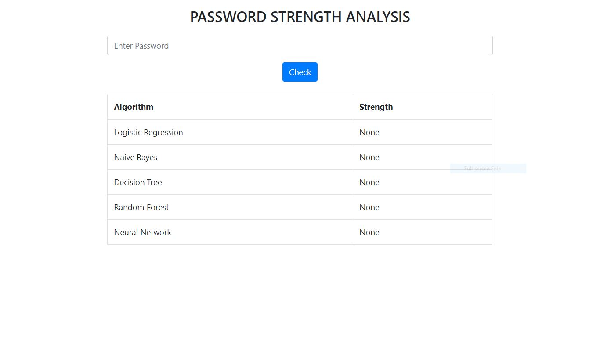
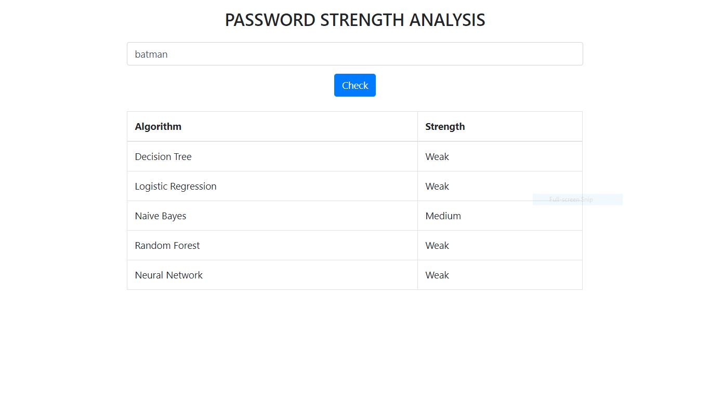
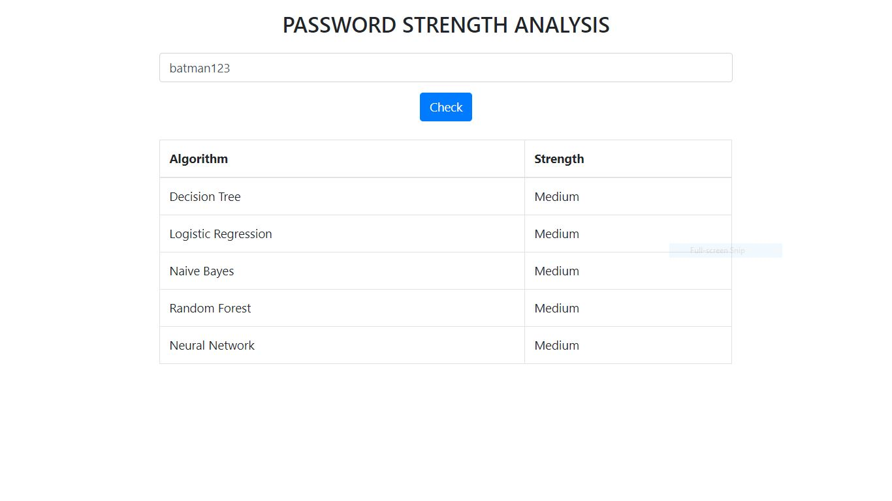
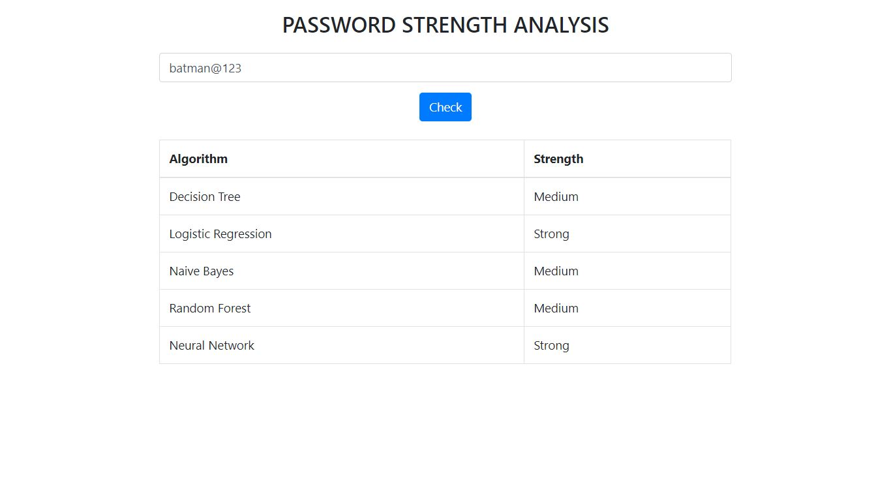

# Password-Strength-Analysis
Password Strength Recognition using Machine Learning Classification Algorithms  

- Flask(Python web development framework) is used for displaying the results
- Algorithms used are 
  - Decision Trees
  - Logistic Regression
  - Naive Bayes (Bernoulli Distribution Model)
  - Random Forest
  - Neural Network (MLP Classifier)
- TfidfVectorizer is used for text feature extraction for passwords

### Steps: 
1. Install **Flask** which is a Python web development framework: ```pip install Flask```
2. Install **scikit-learn** which is a  machine learning library: ```pip install -U scikit-learn```
3. After installing **Flask** and **scikit-learn**, extract the contents in a folder and then run the  ```__init__.py```.
4. Server runs at ```localhost:5000```, type this address in the browser and see all the classification algorithms in action.

### Output






